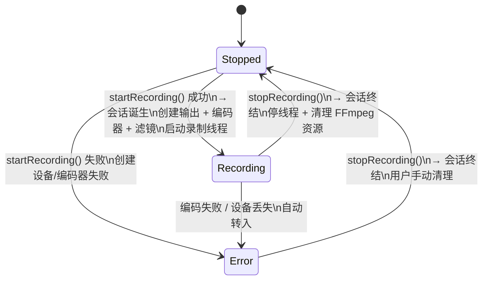

# ScreenRecorder — 录制状态转移说明

## 1. 状态枚举

```
Stopped    — 空闲，无录制会话
Recording  — 正在录制（线程运行中）
Error      — 录制出错（线程异常，会话仍存在，必须手动 stopRecording() 退出）
```

---

## 2. 状态转移图



---

## 3. 转移表

### 3.1 完整转移表

| 源状态 | 操作 | 目标状态 | 会话是否终结 | 说明 |
|---|---|---|---|---|
| **Stopped** | `startRecording()` 成功 | Recording | 否（诞生） | 会话创建 |
| **Stopped** | `startRecording()` 失败 | Error | 否 | 设备/编码器初始化失败 |
| **Stopped** | `stopRecording()` | Stopped | — | 无操作（已在停止态） |
| **Recording** | `stopRecording()` | Stopped | 是 | 停线程 → 清理资源 → 会话终结 |
| **Recording** | 编码失败 / 设备丢失 | Error | 否 | 线程异常，自动转入 Error |
| **Error** | `stopRecording()` | Stopped | 是 | 唯一出口，用户手动清理 |
| **Error** | 任何非 stop 操作 | Error | — | 无操作 |

### 3.2 禁止转移

| 源状态 | 禁止的目标状态 | 理由 |
|---|---|---|
| Stopped | — | 无禁止（startRecording 是唯一合法操作，stopRecording 无害） |
| Recording | Error（通过 stopRecording 直达） | 必须先停线程回到 Stopped，不能跳转到 Error 后直接消解 |
| Error | Recording | 不能从错误直接恢复录制，必须先清理回到 Stopped |

### 3.3 进入 Error 的路径汇总

| 入口 | 触发条件 |
|---|---|
| Stopped → startRecording() 失败 | 设备无法打开 / 编码器初始化失败 |
| Recording → 线程异常 | 编码失败 / 设备丢失 |

---

## 4. 分条目文字说明

### 4.1 Stopped — 空闲

- 无录制会话，文件未打开
- `startRecording()` 成功 → Recording：创建输出文件 + 编码器 + 滤镜图 + 启动录制线程 → 会话诞生
- `startRecording()` 失败 → Error：设备或编码器初始化失败
- `stopRecording()` → Stopped：无操作（幂等）
- `setOutputDir(path)` 只是准备工作，不改变状态、不创建会话

### 4.2 Recording — 录制中

- 录制线程运行中：屏幕捕获 → 无损压缩 → 文件封装
- 循环中持续发射 `recordingTimeUpdated(int seconds)` 信号
- `stopRecording()` → Stopped：设置停止标志 → 等待线程结束 → 关闭输出文件 → 清理 FFmpeg 资源 → 会话终结
- 线程内异常 → Error：编码失败或设备丢失时自动转入
- 禁止直接回到 Stopped 以外的任何状态

### 4.3 Error — 错误

- 录制线程已异常，错误详情通过 `recordError` 信号推送前端
- `stopRecording()` → Stopped：**唯一出口**，关闭输出文件（如有）→ 清理资源 → 会话终结
- 错误不自动终结会话：Error ≠ Stopped，TabManager 保持 RecordSession，标签页不解锁
- 用户必须手动 toggle 按钮（显示「停止录制」）→ stopRecording() 才能退出
- 禁止直接进入 Recording 或其他状态

### 4.4 关键规则总结

- **录制会话诞生**: `startRecording()` 内部全部成功 → state = Recording
- **录制会话终结**: `stopRecording()` 完成 → state = Stopped（无论从 Recording 还是 Error 进入）
- **错误不自动终结**: Error 必须手动 stopRecording() 退出
- **Error 时按钮文字**: 仍显示「停止录制」（因为会话仍存在，用户须主动终止）
- **选择文件夹不是会话**: `setOutputDir()` 不改变状态、不创建会话

---

## 5. 与 TabManager 的联动

### 5.1 录制到播放的切换条件

| ScreenRecorder 状态 | 能否切到播放标签页 | 行为 |
|---|---|---|
| Stopped | ✅ 允许 | TabManager 此时为 Idle，直接切换 |
| Recording | ❌ 禁止 | 录制中，会话活跃 |
| Error | ❌ 禁止 | 必须手动 stopRecording() 先退出 |

播放到录制同理：VideoEngine 在 Empty 或 Stopped 时可切到录制。

### 5.2 TabManager 判断逻辑

```
RecordSession 范围: ScreenRecorder ≠ Stopped  → 锁定录制标签页
                     ScreenRecorder == Stopped → 可切换
```

### 5.3 TabManager 与引擎状态的完整联动表

| 引擎状态变化 | TabManager 反应 |
|---|---|
| ScreenRecorder: Stopped → Recording | Idle → RecordSession |
| ScreenRecorder: Stopped → Error | Idle → RecordSession |
| ScreenRecorder: Recording → Stopped（stopRecording） | RecordSession → Idle |
| ScreenRecorder: Recording → Error | 保持 RecordSession（会话未终结） |
| ScreenRecorder: Error → Stopped（stopRecording） | RecordSession → Idle |

---

## 6. 有限状态机转移控制函数（录制后端的核心）

录制后端的转移校验收敛到一个统一的转移控制函数中。

### 6.1 操作枚举

```cpp
enum class RecordTransition {
    Start,     // 开始录制
    Stop,      // 停止录制
};
```

### 6.2 转移矩阵

```cpp
// Matrix[fromState][transition]
const RecordState transitionMatrix[3][2] = {
    //            Start           Stop
    /* Stopped  */{ Recording,     Stopped   },
    /* Recording*/{ Invalid,       Stopped   },
    /* Error    */{ Invalid,       Stopped   },
};
```

### 6.3 转移控制函数

```cpp
/**
 * @brief 尝试执行状态转移
 * @param op  请求的操作
 * @return 转移允许返回 true，否则返回 false
 *
 * 调用约定：
 *   startRecording/stopRecording 内部先调 tryTransition(op)，
 *   返回 false 则直接返回 false 给调用方。
 */
bool ScreenRecorder::tryTransition(RecordTransition op)
{
    RecordState target = transitionMatrix[m_recordState.load()][static_cast<int>(op)];
    if (target == Invalid) {
        return false;
    }
    return true;
}
```

### 6.4 各方法内部调用模式

```cpp
bool ScreenRecorder::startRecording()
{
    if (!tryTransition(RecordTransition::Start)) return false;

    if (!openInput()) {
        setState(Error, "无法打开屏幕捕获设备");
        return false;
    }
    if (!createOutput()) {
        closeInput();
        setState(Error, "无法创建输出文件");
        return false;
    }
    if (!createFilterGraph()) {
        closeOutput();
        closeInput();
        setState(Error, "无法创建滤镜图");
        return false;
    }

    m_frameCount = 0;
    setState(Recording);
    m_recordThread = QThread::create([this]() { recordingLoop(); });
    m_recordThread->start();
    return true;
}

void ScreenRecorder::stopRecording()
{
    if (!tryTransition(RecordTransition::Stop)) return;

    if (m_recordState.load() == Recording) {
        m_recordState.store(Stopped);
        if (m_recordThread) {
            m_recordThread->quit();
            m_recordThread->wait();
            delete m_recordThread;
            m_recordThread = nullptr;
        }
    }

    closeOutput();
    closeInput();
    cleanupFilterGraph();
    cleanup();

    setState(Stopped);
}
```

### 6.5 录制线程中的异常转入

```cpp
void ScreenRecorder::recordingLoop()
{
    while (m_recordState.load() == Recording) {
        if (!captureFrame()) {
            setState(Error, "屏幕捕获失败");
            return;
        }
        if (!encodeFrame()) {
            setState(Error, "编码失败");
            return;
        }
    }
}
```

### 6.6 带错误信息的 setState

```cpp
void ScreenRecorder::setState(RecordState s, const QString &msg)
{
    m_prevState = static_cast<RecordState>(m_recordState.load());
    m_recordState.store(s);

    if (s == Error) {
        m_errorString = msg;
        emit recordError(msg);
    }

    emit recordStateChanged(s);
}
```

---

*文档版本: 1.0 | 2026-05-06*
