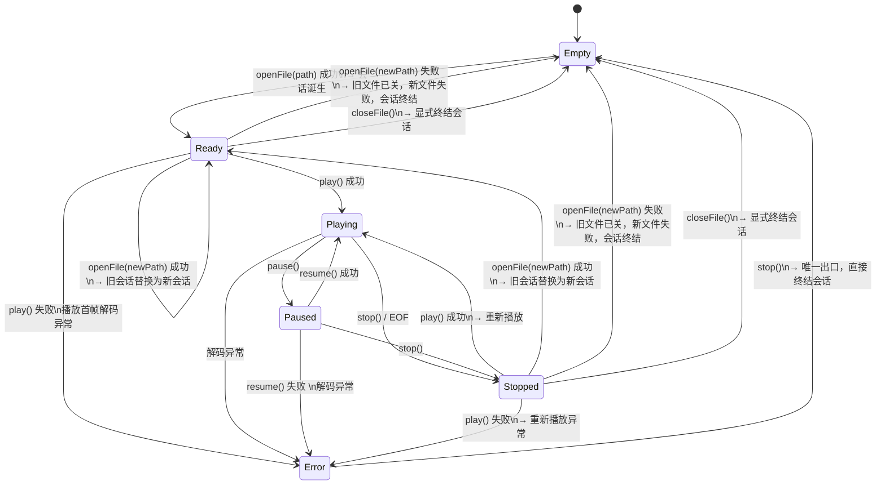

# VideoEngine — 播放状态转移说明

## 1. 状态枚举

```
Empty    — 无会话，无文件关联
Ready    — 当前会话就绪，文件已打开、解码器已初始化
Playing  — 当前会话正在播放
Paused   — 当前会话暂停
Stopped  — 当前会话停止（文件仍打开，可通过 play() 重新播放或通过 closeFile() 终结）
Error    — 当前会话出错（文件仍打开，唯一出口是 stop() → Empty）
```

---

## 2. 状态转移图



---

## 3. 转移表

### 3.1 完整转移表

| 源状态 | 操作 | 目标状态 | 会话是否终结 | 说明 |
|---|---|---|---|---|
| **Empty** | `openFile(path)` 成功 | Ready | 否（诞生） | 会话创建 |
| **Empty** | `openFile(path)` 失败 | Empty | — | 保持空闲 |
| **Ready** | `play()` 成功 | Playing | 否 | 开始播放 |
| **Ready** | `play()` 失败 | Error | 否 | 首帧解码异常（文件打开正常不等于首帧解码正常） |
| **Ready** | `openFile(newPath)` 成功 | Ready | 旧会话终结，新会话诞生 | 原子替换 |
| **Ready** | `openFile(newPath)` 失败 | Empty | 是 | 旧文件已关，新文件失败 |
| **Ready** | `closeFile()` | Empty | 是 | 显式终结 |
| **Playing** | `pause()` | Paused | 否 | 挂起线程 |
| **Playing** | `stop()` | Stopped | 否 | 终止线程，文件保持打开 |
| **Playing** | EOF 自然结束 | Stopped | 否 | 播放到末尾自动停止 |
| **Playing** | 解码异常 | Error | 否 | 线程异常 |
| **Paused** | `resume()` 成功 | Playing | 否 | 恢复播放 |
| **Paused** | `resume()` 失败 | Error | 否 | 恢复时解码异常 |
| **Paused** | `stop()` | Stopped | 否 | 终止线程，文件保持打开 |
| **Stopped** | `play()` 成功 | Playing | 否 | 重新播放（解码器可复用） |
| **Stopped** | `play()` 失败 | Error | 否 | 重新播放异常 |
| **Stopped** | `openFile(newPath)` 成功 | Ready | 旧会话终结，新会话诞生 | 原子替换 |
| **Stopped** | `openFile(newPath)` 失败 | Empty | 是 | 旧文件已关，新文件失败 |
| **Stopped** | `closeFile()` | Empty | 是 | 显式终结 |
| **Error** | `stop()` | Empty | 是 | 唯一出口，直接终结会话 |

### 3.2 禁止转移

| 源状态 | 禁止的目标状态 | 理由 |
|---|---|---|
| Ready | Paused, Stopped | 就绪态只能通过 play() 进入 Playing 或 Error，或通过 openFile/closeFile 改变会话 |
| Playing | Ready, Empty | 不能跳过停止直接回到就绪或切文件 |
| Paused | Ready, Empty | 必须先 stop 或恢复再处理 |
| Stopped | Ready, Paused | Ready 是通过 openFile 切换文件到达的；Paused 语义不通 |
| Error | Ready, Playing, Paused, Stopped | 唯一出口是 stop() → Empty |

### 3.3 stop() 的双重语义

| 当前状态 | 调用 `stop()` 后 | 文件是否关闭 | 会话是否终结 |
|---|---|---|---|
| Playing | Stopped | 否 | 否 |
| Paused | Stopped | 否 | 否 |
| Error | Empty | 是 | 是 |

### 3.4 能进入 Playing 的入口→Error 汇总

所有以 Playing 为目标的入口，都存在失败进入 Error 的可能（即使 openFile 时文件正常，首帧解码或后续解码仍可能失败）：

| 入口 | 成功 | 失败 |
|---|---|---|
| Ready → play() | → Playing | → Error |
| Stopped → play() | → Playing | → Error |
| Paused → resume() | → Playing | → Error |
| Playing 线程中（解码异常） | — | → Error |

---

## 4. 分条目文字说明

### 4.1 Empty — 无会话

- empty 是会话层状态，虽然与其他引擎状态在同一枚举中定义，但有本质区别
- empty 只能通过 `openFile()` 成功进入一个会话的 Ready
- 可以从以下状态步入 empty：

```
Ready   ──openFile(newPath) 失败──→ Empty    (创建新会话失败)
Stopped ──openFile(newPath) 失败──→ Empty    (创建新会话失败)
Ready   ──closeFile()──→ Empty               (显式退出播放环境)
Stopped ──closeFile()──→ Empty               (显式退出播放环境)
Error   ──stop()──→ Empty                    (错误后强制退出)
```

### 4.2 Ready — 当前会话就绪

- 文件已打开，解码器已初始化，可播放或切换文件
- `play()` 成功 → Playing：启动播放线程并拉取首帧
- `play()` 失败 → Error：首帧解码异常
- `openFile(newPath)` 成功 → Ready：关闭旧文件后立即打开新文件，不经过 Empty 中间态，对外表现 Ready → Ready
- `openFile(newPath)` 失败 → Empty：旧文件已关，新文件失败 → 会话终结
- `closeFile()` → Empty：显式终结会话
- 禁止进入 Paused、Stopped

### 4.3 Playing — 正在播放

- 播放线程运行中
- `pause()` → Paused
- `stop()` / EOF → Stopped：终止线程，文件保持打开，不终结会话
- 解码异常 → Error：线程异常，文件保持打开
- 禁止进入 Ready、Empty

### 4.4 Paused — 暂停

- 播放线程挂起
- `resume()` 成功 → Playing：恢复播放
- `resume()` 失败 → Error：恢复时解码异常
- `stop()` → Stopped：终止线程，文件保持打开，不终结会话
- 禁止进入 Ready、Empty

### 4.5 Stopped — 停止

- 文件仍在打开，可重新播放或切换文件
- 到 Empty 的两种语义：
  - `openFile(newPath)` 失败 → Empty：旧文件已关，新文件失败，会话被丢弃
  - `closeFile()` → Empty：显式退出播放环境（切到录制标签页 / 程序退出）
- `play()` 成功 → Playing：重新播放当前文件（解码器可复用），非异常进入，会话不终结
- `play()` 失败 → Error：重新播放异常，会话仍存在，必须手动 stop() 退出
- `openFile(newPath)` 成功 → Ready：关闭旧文件 → 打开新文件，旧会话终结、新会话诞生，不经过 Empty 中间态
- 禁止进入 Ready、Paused

### 4.6 Error — 错误

- 文件仍在打开，错误详情已通过 `errorOccurred` 信号推送前端
- `stop()` → Empty：异常结束会话的唯一出口，关闭文件并清理资源，直接进入 Empty
- 进入 Error 的可能路径：
  - Ready → play() 失败（首帧解码异常）
  - Playing → 解码异常（线程运行时异常）
  - Paused → resume() 失败（恢复时解码异常）
  - Stopped → play() 失败（重新播放异常）
- 禁止进入 Ready、Playing、Paused、Stopped

### 4.7 关键规则总结

- **能 Playing 就可能 Error**：Ready/Stopped→play() 和 Paused→resume() 都有成功/失败两条分支
- **非异常进入 Stopped（Playing→stop/EOF 或 Paused→stop）**：会话不终结，文件保持打开
- **异常进入 Empty（Error→stop）**：直接终结会话，不经过 Stopped
- **中间 Empty 瞬态不出现**：Ready→openFile(newPath)→Ready 和 Stopped→openFile(newPath)→Ready 均不经过 Empty
- **stop() 的双重语义**：Playing/Paused 时 → Stopped；Error 时 → Empty
- **openFile() 前置条件**：Empty / Ready / Stopped。Playing/Paused/Error 时被拒绝（comboBox disabled 为第一道防线）

---

## 5. 与 TabManager 的联动

### 5.1 播放到录制的切换条件

| VideoEngine 状态 | 能否切到录制标签页 | 行为 |
|---|---|---|
| Empty | ✅ 允许 | TabManager 此时为 Idle，直接切换 |
| Stopped | ✅ 允许 | 隐式调用 `closeFile()` → Empty → Idle → 切换 |
| Ready | ❌ 禁止 | 会话活跃 |
| Playing | ❌ 禁止 | 会话活跃 |
| Paused | ❌ 禁止 | 会话活跃 |
| Error | ❌ 禁止 | 必须手动 stop() 先退出 |

录制到播放同理：ScreenRecorder 在 Stopped 时可切到播放。

### 5.2 TabManager 判断逻辑

```
PlaySession 范围: VideoEngine ∈ {Ready, Playing, Paused, Error}  → 锁定标签页
                   VideoEngine ∈ {Empty, Stopped}               → 可切换

切换动作（用户在 Stopped 时点击录制标签页）:
    m_engine->closeFile()       → Empty
    TabManager 检测 Empty       → Idle → 正常切换
```

### 5.3 TabManager 与引擎状态的完整联动表

| 引擎状态变化 | TabManager 反应 |
|---|---|
| VideoEngine: Empty → Ready | Idle → PlaySession |
| VideoEngine: Ready → Playing / Paused / Error | 保持 PlaySession |
| VideoEngine: Playing/Paused → Stopped（stop/EOF） | 保持 PlaySession（会话仍存在） |
| VideoEngine: Stopped → Ready（openFile newPath 成功） | 保持 PlaySession（新会话替代旧会话） |
| VideoEngine: Stopped → Empty（openFile newPath 失败 / closeFile） | PlaySession → Idle |
| VideoEngine: Playing/Paused → Error | 保持 PlaySession |
| VideoEngine: Error → Empty（stop） | PlaySession → Idle |
| VideoEngine: Ready → Error（play 失败） | 保持 PlaySession |

---

## 6. 有限状态机转移控制函数（视频播放后端的核心）

后端所有对外方法（`openFile`, `play`, `pause`, `resume`, `stop`, `closeFile`）的校验逻辑不应分散在各方法中，而应收敛到一个统一的转移控制函数中，作为 VideoEngine 的核心调度器。

### 6.1 操作枚举

```cpp
enum class Transition {
    OpenFile,       // 打开（或切换）文件
    Play,           // 开始或恢复播放
    Pause,          // 暂停
    Resume,         // 恢复
    Stop,           // 停止
    CloseFile,      // 关闭文件
};
```

### 6.2 转移矩阵

用二维查找表替代散落在各方法中的 if/else 校验。`Matrix[from][op]` 返回允许的目标状态，`Invalid` 表示禁止。

```cpp
// Matrix[fromState][transition]
const State transitionMatrix[6][6] = {
    //            OpenFile    Play        Pause       Resume      Stop        CloseFile
    /* Empty   */{ Ready,      Invalid,    Invalid,    Invalid,    Invalid,    Invalid   },
    /* Ready   */{ Ready,      Playing,    Invalid,    Invalid,    Invalid,    Empty     },
    /* Playing */{ Invalid,    Invalid,    Paused,     Invalid,    Stopped,    Invalid   },
    /* Paused  */{ Invalid,    Invalid,    Invalid,    Playing,    Stopped,    Invalid   },
    /* Stopped */{ Ready,      Playing,    Invalid,    Invalid,    Invalid,    Empty     },
    /* Error   */{ Invalid,    Invalid,    Invalid,    Invalid,    Empty,      Invalid   },
};
```

### 6.3 转移控制函数

```cpp
/**
 * @brief 尝试执行状态转移
 * @param op  请求的操作
 * @return 转移成功返回 true，否则返回 false
 *
 * 内部行为：
 *   1. 查表：Matrix[m_state][op]
 *   2. 若返回 Invalid → return false（无副作用，不发射信号）
 *   3. 若返回有效目标 → 执行业务逻辑 → setState(target)
 *
 * 调用约定：
 *   openFile/play/pause/resume/stop/closeFile 等方法内部先调 tryTransition(op)，
 *   如果返回 false 则直接返回 false 给调用方。
 */
bool VideoEngine::tryTransition(Transition op)
{
    State target = transitionMatrix[m_state.load()][static_cast<int>(op)];
    if (target == Invalid) {
        return false;
    }

    // 转移允许，具体业务逻辑仍由各方法处理
    // 各方法负责：执行 FFmpeg 操作 → 成功后调用 setState(target)
    return true;
}
```

### 6.4 各方法内部调用模式

```cpp
bool VideoEngine::play() {
    if (!tryTransition(Transition::Play)) return false;

    // 转移校验通过，执行具体业务
    if (!startPlaybackThread()) {
        setState(Error, "解码首帧失败");      // 业务失败 → 进入错误
        return false;
    }
    setState(Playing);                         // 业务成功 → 进入目标
    return true;
}

bool VideoEngine::stop() {
    if (!tryTransition(Transition::Stop)) return false;

    terminateThread();
    if (m_state.load() == Error) {
        closeResources();                      // Error → stop: 关闭文件
        setState(Empty);
    } else {
        setState(Stopped);                     // Playing/Paused → stop: 保留文件
    }
    return true;
}

bool VideoEngine::openFile(const QString &path) {
    if (!tryTransition(Transition::OpenFile)) return false;

    closeResources();                          // 关闭旧文件
    if (!openAndInit(path)) {
        setState(Empty, "无法打开文件: " + path);
        return false;
    }
    setState(Ready);
    return true;
}
```

### 6.5 带错误信息的 setState

上述 `setState(State, QString)` 在设置为 Error 时自动存储错误信息并发射 `errorOccurred` 信号：

```cpp
void VideoEngine::setState(State s, const QString &msg) {
    m_prevState = m_state.load();
    m_state.store(s);

    if (s == Error) {
        m_errorString = msg;
        emit errorOccurred(msg);
    }

    emit stateChanged(s);
}
```

---

*文档版本: 1.1 | 2026-05-06*
