# ScreenRecorderPlayer — 软件设计文档

## 1. 概述

本文档定义 ScreenRecorderPlayer 的软件架构、模块接口和构建配置。采用前后端分离模式，录制和播放各有独立的引擎类（QObject 纯后端）和界面类（QWidget 前端），状态转移逻辑全部由后端掌控。

---

## 2. 项目结构

```
Root/
├── bin/                       ← 可执行文件输出目录
├── build/
│   ├── RelWithDebInfo/        ← 中间构建文件
│   └── Release/               ← 中间构建文件
├── install/                   ← Release 安装目录（exe + DLL）
├── cpp/
│   ├── main.cpp
│   ├── mainwindow.cpp
│   ├── recordwidget.cpp
│   ├── screenrecorder.cpp     ← 录制引擎（纯后端）
│   ├── videoplayer.cpp        ← 播放前端
│   ├── videoengine.cpp        ← 播放引擎（纯后端）
│   ├── tabmanager.cpp
│   └── filemanager.cpp
├── hpp/
│   ├── mainwindow.hpp
│   ├── recordwidget.hpp
│   ├── screenrecorder.hpp
│   ├── videoplayer.hpp
│   ├── videoengine.hpp
│   ├── tabmanager.hpp
│   └── filemanager.hpp
├── doc/
├── .vscode/
└── CMakeLists.txt
```

---

## 3. 前后端分离架构

### 3.1 设计原则

| 原则 | 说明 |
|---|---|
| 状态归后端 | 状态转移逻辑、校验规则、状态存储全部由引擎类负责 |
| 请求/响应 | 前端把用户操作转发为后端方法调用（请求）；后端通过信号通告结果（响应） |
| 前端不判断 | 前端不写 `if (state == xxx)` 来决定能不能做某事；只根据信号更新 UI |

### 3.2 前后端对应关系

| 功能 | 前端（QWidget） | 后端（QObject） | 持有关系 |
|---|---|---|---|
| 屏幕录制 | RecordWidget | ScreenRecorder | RecordWidget 持有 ScreenRecorder* |
| 视频播放 | VideoPlayer | VideoEngine | VideoPlayer 持有 VideoEngine* |

### 3.3 会话的生命周期

录制和播放各是一次**有边界的会话**。一次会话从"关联文件并启动"那一刻诞生，到"脱离文件回到空闲"那一刻终结。

- 会话诞生 → 会话活跃 → 会话终结 → 空闲
- 选择存放文件夹（录制）或浏览文件夹（播放）**不是**会话的组成部分——它们只是为会话做准备
- 会话活跃期间，TabManager 锁定对应标签页，禁止切换
- 会话终结后，TabManager 恢复 Idle，标签页自由切换
- 错误**不会**自动终结会话——用户必须主动操作以清理

### 3.4 会话状态由谁管理

- 状态校验（如"不能在空闲时播放""不能在播放中再次播放"）→ **后端**
- 状态存储（`m_state` 原子变量）→ **后端**
- 状态通告（`stateChanged` 信号）→ **后端发出，前端响应**
- 按钮文字/可见性 → **前端**根据信号被动更新，不自行判断

---

## 4. 类设计

### 4.1 MainWindow

MainWindow 是组装所有子组件的顶层容器，不包含业务逻辑。

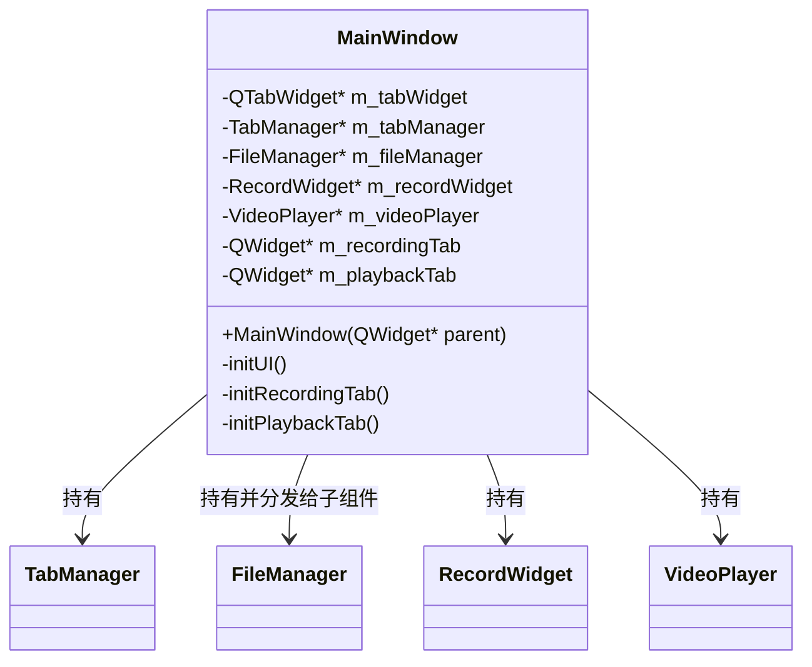

**录制标签页 → RecordWidget**

| 控件 | 成员名 | 说明 |
|---|---|---|
| 输出文件夹路径 | `m_folderPathEdit` (QLineEdit) | 可编辑文本框 |
| 浏览文件夹按钮 | `m_browseBtn` (QPushButton) | ≡ FileManager |
| 录制切换按钮 | `m_toggleRecordBtn` (QPushButton) | 三态：开始录制 / 停止录制 |
| 已录制时间 | `m_recordingTimeLabel` (QLabel) | 来自后端信号 |
| 当前文件名 | `m_currentFileLabel` (QLabel) | 来自后端信号 |

**后端**: ScreenRecorder* — 屏幕捕获 → 无损压缩 → 文件封装。信号: `recordStateChanged` / `recordingTimeUpdated` / `recordError`

**播放标签页 → VideoPlayer**

| 控件 | 成员名 | 说明 |
|---|---|---|
| 渲染区域 | `m_videoWidget` (QOpenGLWidget) | GPU 纹理渲染 |
| 视频文件下拉列表 | `m_fileComboBox` (QComboBox) | ≡ FileManager |
| 选择文件夹按钮 | `m_browseBtn` (QPushButton) | ≡ FileManager |
| 播放 / 暂停恢复 / 停止 | `m_playBtn`, `m_pauseResumeBtn`, `m_stopBtn` | | |
| 总时长 / 当前时间 | `m_totalTimeLabel`, `m_currentTimeLabel` | | |
| 播放速度 | `m_fpsSpinBox` (QSpinBox) | 1–200 fps |
| 状态/错误 | `m_statusLabel` (QLabel) | | |

**后端**: VideoEngine* — 解码 → 格式转换 → 帧输出。信号: `stateChanged` / `frameReady` / `videoInfoChanged` / `frameCountUpdated` / `errorOccurred`

**FileManager 引用**: 两个子组件各自持有 `FileManager*`，由 MainWindow 创建后传入。录制侧用于获取输出目录和生成文件名；播放侧用于获取视频文件夹路径和文件列表。

---

### 4.2 RecordWidget（录制前端）

RecordWidget 是录制会话的前端容器。它持有 UI 控件和后端引擎引用，但不参与状态判断。

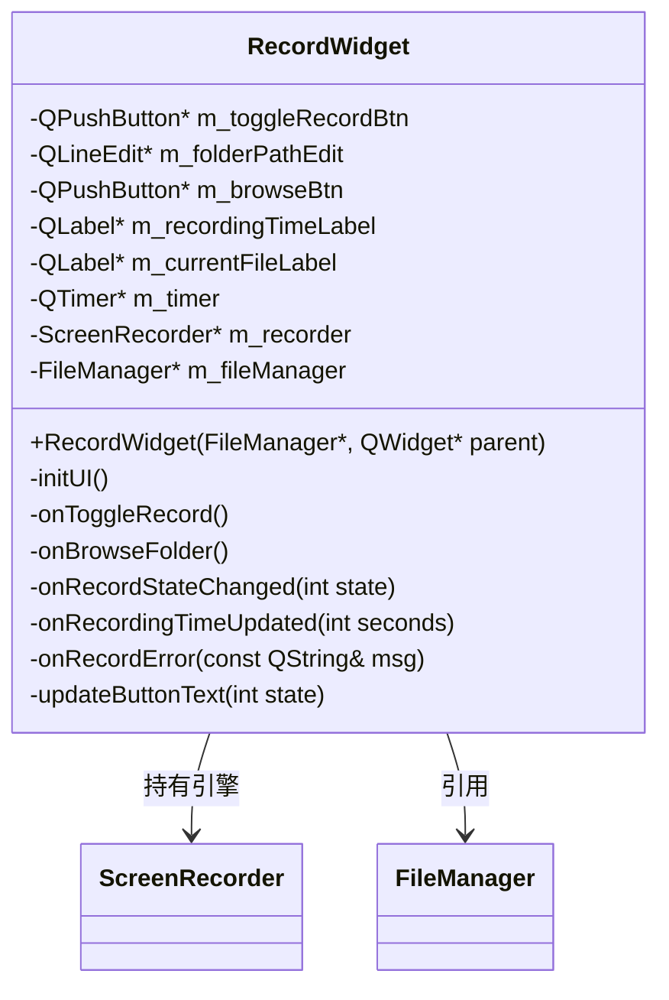

**UI 布局**（垂直排列）:

```
[输出文件夹:  [___________路径___________] [浏览…]]
[  ▶ 开始录制  ]
[ 已录制: 00:00      当前文件: xxx.mkv  ]
```

**信号/槽**:

```
onToggleRecord()
    → 不判断状态
    → m_recorder->startRecording() 或 stopRecording()
    （Qt 主线程串行事件处理保证操作原子性，不会出现重入）

onBrowseFolder()
    → QFileDialog → FileManager → m_folderPathEdit.setText()

onRecordStateChanged(int state)
    → updateButtonText() + 启动/停止定时器

onRecordingTimeUpdated(int seconds)
    → m_recordingTimeLabel->setText()

onRecordError(const QString& msg)
    → 显示错误信息 + m_toggleRecordBtn 恢复为「开始录制」
```

---

### 4.3 ScreenRecorder（录制引擎，纯后端）

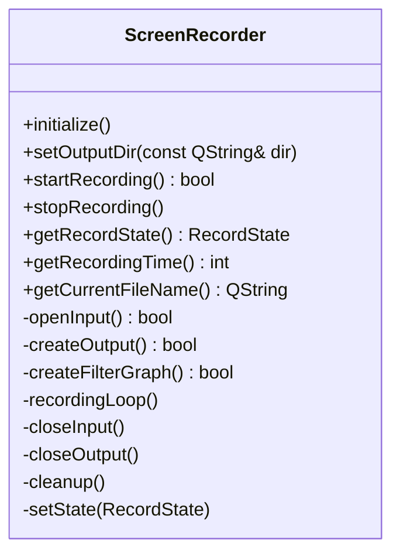

**状态枚举**: `Stopped` | `Recording` | `Error`

**录制线程**: 屏幕捕获 (DXGI/ddagrab/gdigrab) → AVFilter 格式转换 (bgra→bgr0) → FFV1 无损编码 → MKV 封装

**信号**: `recordStateChanged(int)` / `recordingTimeUpdated(int)` / `recordError(const QString&)`

#### 录制引擎状态机

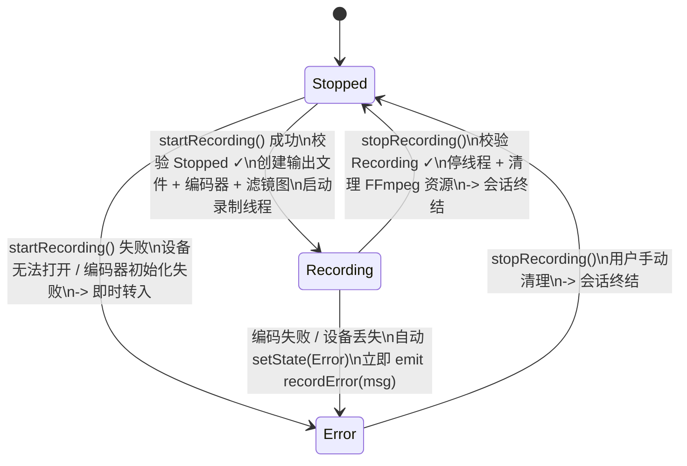

**转移表**:

| 源状态 → 操作 | `startRecording()` | `stopRecording()` |
|---|---|---|
| **Stopped** | → Recording ✓（成功）/ → Error（失败） | 无操作 |
| **Recording** | 无操作 | → Stopped ✓ |
| **Error** | 无操作 | → Stopped ✓（清理） |

**前端 UI 响应**:

| 引擎状态 | 按钮文字 | 文件夹行 | 定时器 |
|---|---|---|---|
| Stopped | 「开始录制」 | enabled | 停止 |
| Recording | 「停止录制」 | disabled | 启动 |
| Error | 「停止录制」 | enabled | 停止，显示错误信息 |

---

### 4.4 录制会话生命周期

选择文件夹→`setOutputDir()` 只是准备工作，**不是**会话的开始。会话从 `startRecording()` 成功返回才诞生。

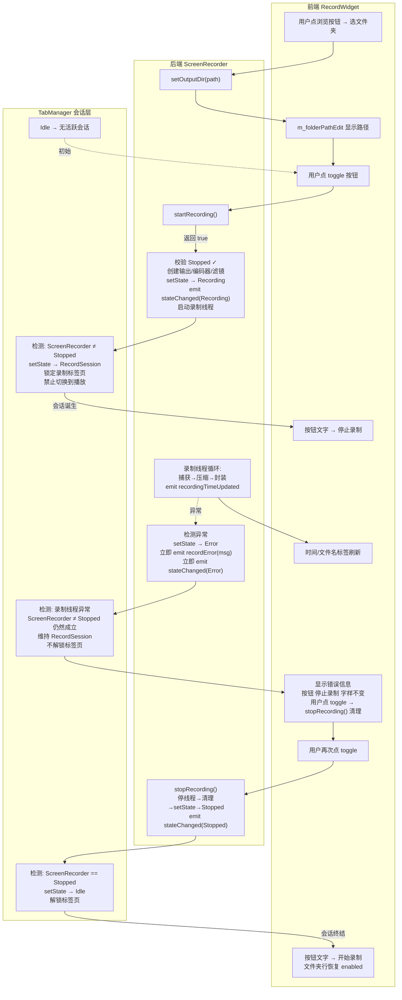

**关键时序**:

1. **会话诞生条件**: `startRecording()` 内部全部成功 → state = Recording
2. **会话消亡条件**: `stopRecording()` 清理完成 → state = Stopped
3. **错误不终结会话**: Error 状态下 ScreenRecorder ≠ Stopped，TabManager 保持 RecordSession，用户必须手动 `stopRecording()` 清理

---

### 4.5 VideoPlayer（播放前端）

VideoPlayer 是播放会话的前端容器。所有按钮槽函数**仅转发调用**给后端引擎，不自行校验状态。

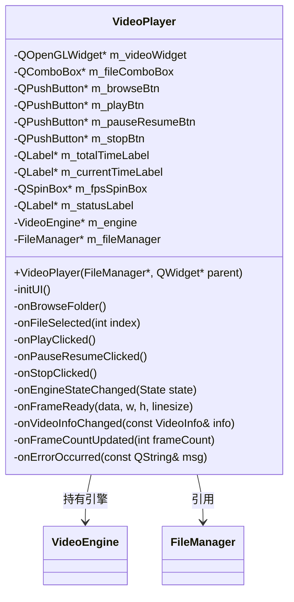

**UI 布局**（垂直排列）:

```
[选择视频文件夹…]  [▼ video1.mkv          ]
┌─────────────────────────────────────────┐
│            QOpenGLWidget                │
└─────────────────────────────────────────┘
[▶ 播放]  [⏸ 暂停]  [⏹ 停止]
00:15 / 05:30
播放速度 (fps): [20 ▲▼]
状态: 播放中
```

**信号/槽**:

```
onBrowseFolder()
    → QFileDialog → FileManager → 刷新 m_fileComboBox

onFileSelected(int index)
    → m_engine->openFile(fullPath)

onPlayClicked()
    → m_engine->setPlaybackSpeed(m_fpsSpinBox->value())
    → m_engine->play()

onPauseResumeClicked()
    → m_engine->pause() 或 m_engine->resume()

onStopClicked()
    → m_engine->stop()

onEngineStateChanged(State state)
    → 根据 state 更新各按钮 enabled/文字 （不自行判断，纯响应）

onFrameReady(data, w, h, linesize)
    → m_videoWidget->presentFrame(data, w, h, linesize)

onVideoInfoChanged(const VideoInfo& info)
    → m_totalTimeLabel->setText(formatDuration(info.duration))

onFrameCountUpdated(int frameCount)
    → m_currentTimeLabel->setText(...)

onErrorOccurred(const QString& msg)
    → m_statusLabel->setText(msg)
```

---

### 4.6 VideoEngine（播放引擎，纯后端）

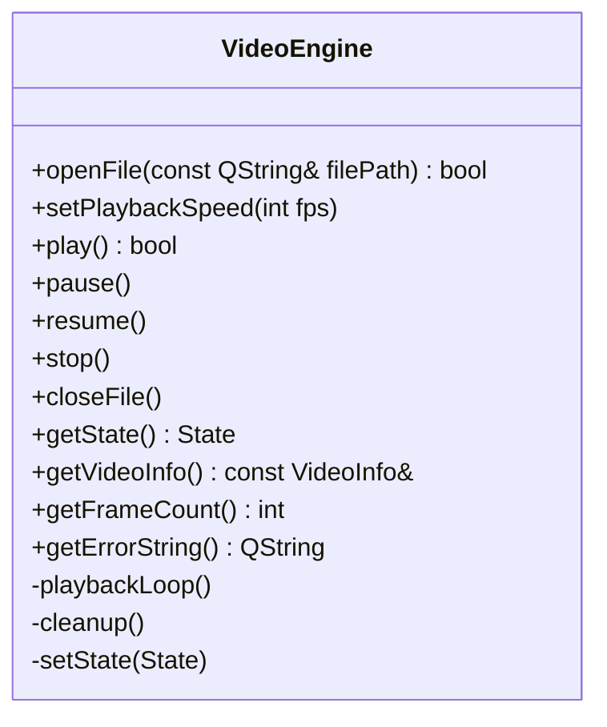

**状态枚举**:

| 状态 | 含义 | 会话解释 |
|---|---|---|
| `Empty` | 无会话，未关联视频文件 | 空闲 |
| `Ready` | 当前会话就绪，文件已打开 | 会话存在（可播放或切换文件） |
| `Playing` | 当前会话正在播放 | 会话活跃 |
| `Paused` | 当前会话暂停 | 会话活跃（暂停态） |
| `Stopped` | 当前会话停止，文件仍打开 | 会话存在（可重新播放或切换文件） |
| `Error` | 当前会话出错，文件仍打开 | 会话存在（唯一出口 stop() → Empty） |

**接口**:

| 方法 | 前置条件 | 行为 | 后置状态 |
|---|---|---|---|
| `openFile(path)` | Empty / Ready / Stopped | 关闭旧文件 → 打开新文件 → FFmpeg 解析 → 初始化解码器 → 填充 VideoInfo | Ready（成功）/ Empty（失败） |
| `setPlaybackSpeed(fps)` | — | 设置目标播放帧率（1–200），用于计算帧间间隔 | 不变 |
| `play()` | Ready / Stopped / Paused | 启动/恢复播放线程 | Playing（成功）/ Error（失败） |
| `pause()` | Playing | 挂起播放线程 | Paused |
| `resume()` | Paused | 恢复播放线程 | Playing（成功）/ Error（失败） |
| `stop()` | Playing / Paused / Error | Playing/Paused→终止线程保留文件; Error→终止线程关闭文件 | Stopped（Playing/Paused） / Empty（Error） |
| `closeFile()` | Ready / Stopped | 关闭文件 + 清理所有 FFmpeg 资源 | Empty |

**播放线程**: 读取 → FFmpeg 解码 → SwsScale BGRA → 帧数据通过信号发送至主线程

**信号**: `stateChanged(State)` / `frameReady(QByteArray, int, int, int)` / `videoInfoChanged(VideoInfo)` / `frameCountUpdated(int)` / `errorOccurred(QString)`

#### 播放引擎状态机

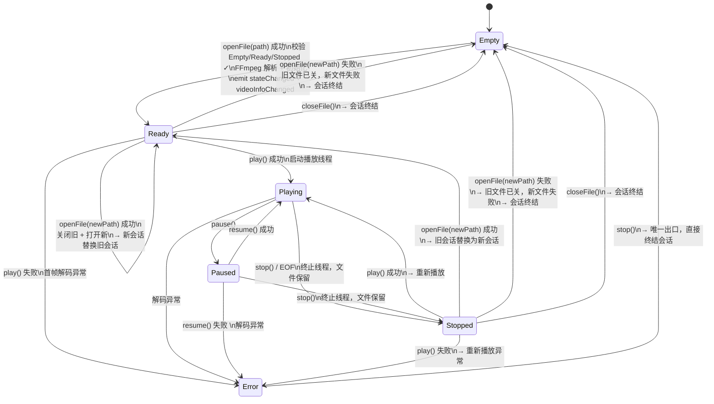

**前端 UI 响应表**:

| 引擎状态 | playBtn | pauseResumeBtn | stopBtn | comboBox | statusLabel |
|---|---|---|---|---|---|
| Empty | disabled | 隐藏 | disabled | enabled | "未关联文件" |
| Ready | enabled | 隐藏 | disabled | enabled | "已就绪，可播放或选择文件" |
| Playing | disabled | enabled（"暂停"） | enabled | disabled | "播放中" |
| Paused | enabled | enabled（"恢复"） | enabled | disabled | "已暂停" |
| Stopped | enabled | 隐藏 | disabled | enabled | "已停止" |
| Error | enabled | 隐藏 | enabled | disabled | 显示错误信息 |

---

### 4.7 播放会话生命周期

打开文件（`openFile()` 成功）即诞生会话。关闭文件（`closeFile()` → Empty）或 openFile 切换到另一个文件时终结旧会话。

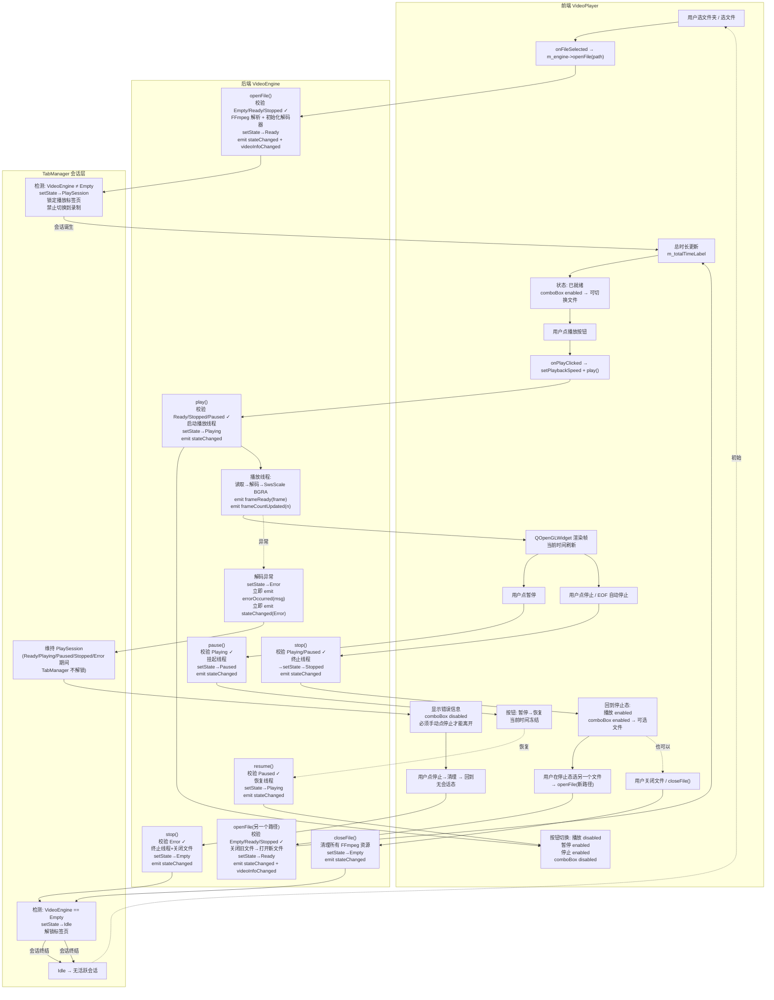

**关键时序**:

1. **会话诞生条件**: `openFile()` 全部成功 → state = Ready。此时 comboBox **enabled**
2. **Playing / Paused / Error 期间**: comboBox **disabled**，用户不能选择另一个文件
3. **Playing / Paused → stop() / EOF → Stopped**: 终止线程，文件不关。comboBox 恢复 enabled，用户可重新播放或选新文件
4. **Error → stop() → Empty**: 唯一出口，直接终结会话，关闭文件
5. **Ready / Stopped 态选新文件**: `openFile(新路径)` → Ready（原子替换，不经过 Empty）
6. **Stopped 态重新播放**: `play()` → Playing，解码器可复用

---

### 4.8 TabManager（标签页管理器）

TabManager 管理的是**会话层**状态——是否有会话存在——而非引擎的瞬时状态。两者是不同概念层次。

| 层 | 管理者 | 含义 | 示例状态值 |
|---|---|---|---|
| 引擎层 | ScreenRecorder / VideoEngine | 录制/播放引擎的瞬时技术状态 | Stopped, Recording, Playing, Paused、Ready… |
| 会话层 | TabManager | 是否存在活跃会话 | Idle, RecordSession, PlaySession |

**TabManager 的互斥原理**: PlaySession 期间（Ready/Playing/Paused/Stopped/Error），默认锁定播放标签页。但 Stopped 态下允许切到录制——由 TabManager 触发隐式 closeFile() 终结会话。

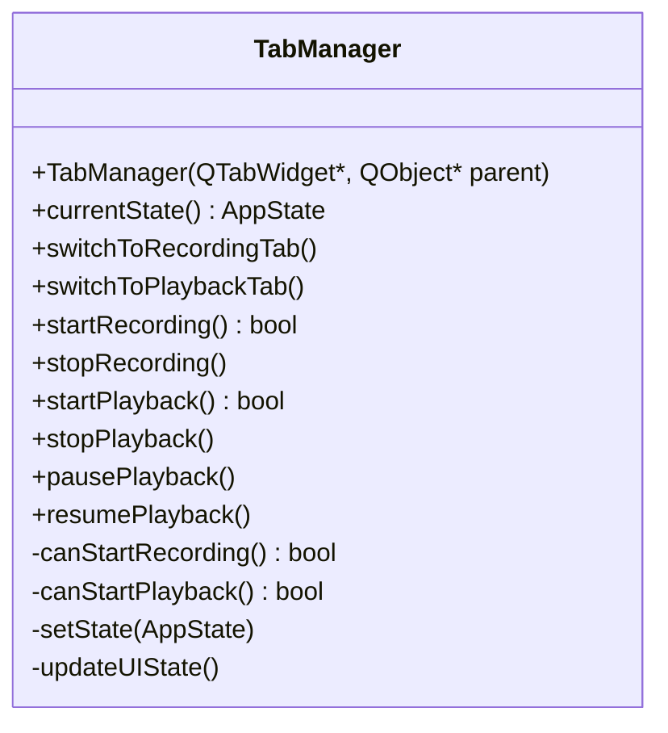

**会话层状态枚举**:

| 状态 | 含义 | 判定条件 |
|---|---|---|
| `Idle` | 双方均无活跃会话 | ScreenRecorder == Stopped **且** VideoEngine == Empty |
| `RecordSession` | 录制会话活跃 | ScreenRecorder ≠ Stopped（Recording 或 Error） |
| `PlaySession` | 播放会话存在 | VideoEngine ≠ Empty（Ready / Playing / Paused / Stopped / Error） |

#### TabManager 状态机

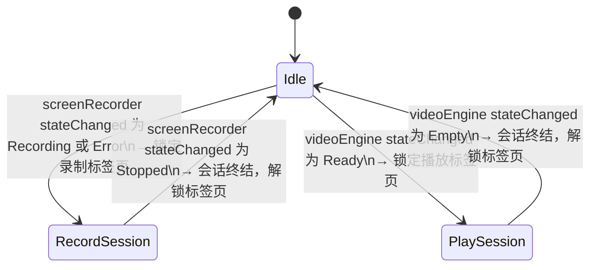

**互斥规则**:

| 源 | 触发条件 | TabManager 动作 |
|---|---|---|
| ScreenRecorder ≠ Stopped | 录制会话存在 | → RecordSession，锁定录制标签页，禁止切换到播放 |
| VideoEngine ≠ Empty | 播放会话存在 | → PlaySession，锁定播放标签页，禁止切换到录制 |
| ScreenRecorder → Stopped | 录制会话终结 | → Idle，解锁标签页 |
| VideoEngine → Empty | 播放会话终结 | → Idle，解锁标签页 |
| startRecording() | 校验 state == Idle | 仅空闲时允许 |
| startPlayback() | 校验 state == Idle | 仅空闲时允许 |

**与后端引擎的联动**:

| 引擎状态变化 | TabManager 反应 |
|---|---|
| ScreenRecorder: Stopped → Recording | setIdle → RecordSession |
| ScreenRecorder: Recording → Error | 保持 RecordSession（会话未终结） |
| ScreenRecorder: Error → Stopped（stopRecording 后） | RecordSession → Idle |
| VideoEngine: Empty → Ready | Idle → PlaySession |
| VideoEngine: 从 Playing/Paused/Error → Stopped（stop/EOF 后） | 保持 PlaySession（会话仍存在，用户可重新播放、切换文件或切到录制） |
| VideoEngine: Stopped → Ready（openFile newPath 成功） | 保持 PlaySession（新会话替代旧会话） |
| VideoEngine: Stopped → Empty（openFile newPath 失败 / closeFile / 隐式 closeFile 切标签页） | PlaySession → Idle |
| VideoEngine: Playing/Paused → Error | 保持 PlaySession |
| VideoEngine: Error → Empty（stop） | PlaySession → Idle |
| VideoEngine: Ready → Error（play 失败） | 保持 PlaySession |

---

### 4.9 FileManager（集中文件路径后端）

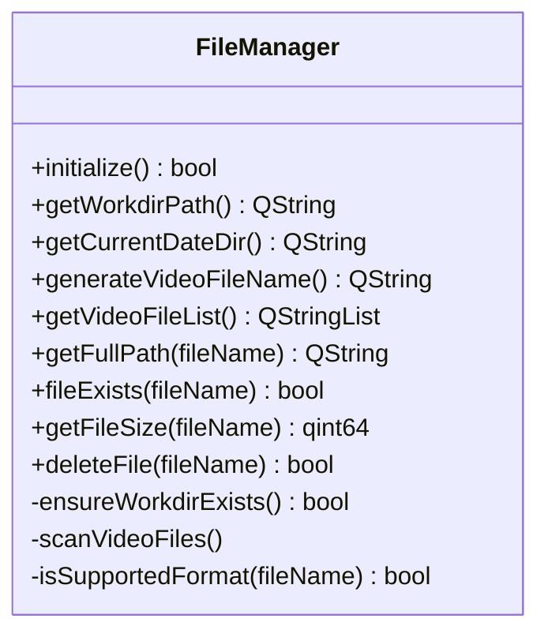

**目录结构**:

```
videodir/                          ← 视频根目录
└── 20260506/                      ← 日期子目录（启动时按当天日期创建）
    ├── 0506-14-30-25-123.mkv
    └── 0506-14-32-10-456.mkv
```

**接口分工**:

| 接口 | 录制侧用法 | 播放侧用法 |
|---|---|---|
| `getCurrentDateDir()` | 获取默认输出目录 | 获取视频文件夹路径 |
| `generateVideoFileName()` | 生成新文件名（`MMdd-hh-mm-ss-zzz.mkv`） | — |
| `getVideoFileList()` | — | 填充 QComboBox 下拉列表 |
| `getFullPath(fileName)` | 拼接输出完整路径 | 拼接播放完整路径 |

**信号**: `fileListUpdated()` / `fileError(const QString&)`

---

## 5. 类关系图

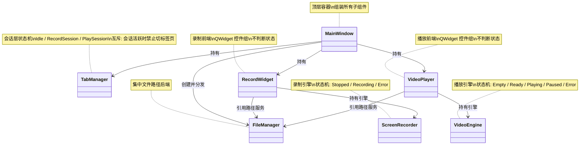

**数据流向**:

```
前端 ──[方法调用]──→ 后端 ──[信号]──→ 前端
(用户操作)          (状态转移)       (UI 更新)

后端 ──[stateChanged]──→ TabManager ──[stateChanged/recordingStarted/…]──→ MainWindow
(引擎状态变化)              (会话层判断)                                    (全局调度)
```

---

## 6. 核心设计对比：录制会话 vs 播放会话

| 维度 | 录制会话 | 播放会话 |
|---|---|---|
| **诞生条件** | `startRecording()` 成功 → Recording | `openFile()` 成功 → Ready |
| **终结条件** | `stopRecording()` → Stopped | `closeFile()` → Empty；或 Error→stop()→Empty |
| **Error 后行为** | 手动 stopRecording() → Stopped（会话终结） | 手动 stop() → Empty（会话终结） |
| **中间态** | — | Playing/Paused→stop()→Stopped（会话保留） |
| 用户点停止 | Recording → Stopped（终结） | Playing/Paused → Stopped（保留）; Error → Empty（终结） |
| **TabManager** | Rec. ≠ Stopped → RecordSession | Vid. ≠ Empty → PlaySession（含 Stopped） |
| **跨会话切换** | Stopped 允许切 | Stopped → 隐式 closeFile() → Idle → 切 |
| FSM 核心 | tryTransition(RecordTransition) | tryTransition(Transition) + transitionMatrix[6][6] |

---

## 7. 构建配置

| 变量 | 来源 | 示例 |
|---|---|---|
| `Qt5_DIR` | `-D` 参数 | `X:/Qt/5.15.13/gcc12/lib/cmake/Qt5` |
| `FFMPEG_ROOT` | `-D` 参数 | `D:/Program/ffmpeg` |
| `CMAKE_BUILD_TYPE` | `-D` 参数 | `RelWithDebInfo` / `Release` |

### 构建目标

> 新增 `videoengine.{cpp,hpp}` — 播放引擎前后端分离的 VideoEngine 类。

| 目标 | 源文件 |
|---|---|
| `ScreenRecorderPlayer` | main, mainwindow, recordwidget, screenrecorder, videoplayer, videoengine, tabmanager, filemanager |

---

*文档版本: 3.6 | 2026-05-06*
